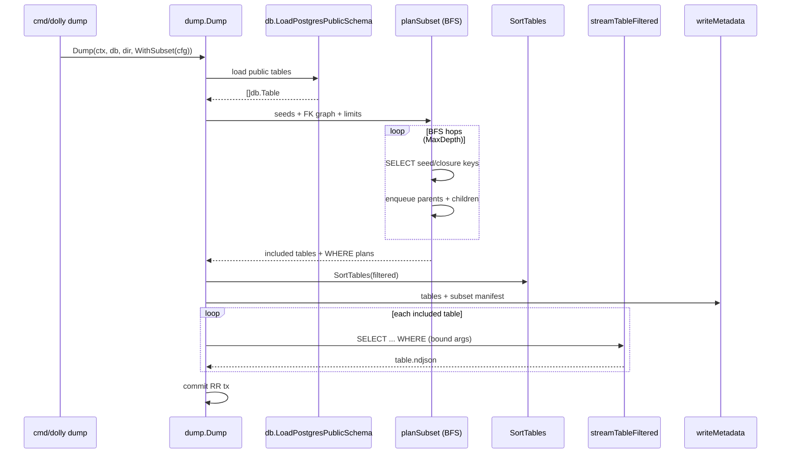

# Design: dolly-subset-dag

## Technical Approach

Extend `internal/dump` with a **subset planner** that runs before streaming when `WithSubset(cfg)` is set. Flow: load `public` schema → validate seeds → **BFS FK closure** (bidirectional) → `SortTables` on included tables only → stream each table with compiled parameterized `WHERE` (merged seed + closure predicates) → write `metadata.json` including a **subset manifest**.

Full dump remains default (`SubsetConfig` nil). Reuse existing RR snapshot, NDJSON layout, `pgx.Identifier` + `$N` args, and `SortTables` on the induced subgraph.

```go
type PredicateOp string // Eq, In, IsNull

type RowPredicate struct {
    Table  string
    Column string
    Op     PredicateOp
    Values []any // bound only; never interpolated
}

type SubsetLimits struct {
    MaxDepth      int
    MaxTables     int
    MaxRows       int // global cap across closure reads
    MaxInListSize int // chunk IN / ANY batches
}

type SubsetConfig struct {
    Seeds  []RowPredicate
    Limits SubsetLimits
}

func WithSubset(cfg SubsetConfig) Option
```

**Planner** (`planSubset(ctx, q, tables, cfg) → planResult`): build `childToParents` / `parentToChildren` from `[]db.Table` (same-schema `public` only; error on external FK targets). For each seed, `SELECT` PK values matching compiled predicate. BFS queue items `(table, pkValues)` with visited `(table, pk)` dedup. Each hop: discover child rows via `fk_col = ANY($1)`; discover parent PKs from child FK columns (skip NULL FKs). Enforce `MaxDepth`, `MaxTables`, `MaxRows`, `ctx.Done()`. Output: `map[tableName]tablePlan{predicates []compiledWhere, rowCount}`.

**Stream**: extend `streamTable` → `streamTableFiltered(ctx, q, table, dir, where compiledWhere)` using fixed templates: `col = $1`, `col = ANY($1)`, `col IS NULL`. Merge multiple predicates per table with `OR` inside parentheses when needed.

**MVP constraint**: single-column PK per table for closure keys; composite PK tables rejected at plan time with clear error (proposal out-of-scope).

## Architecture Decisions

| Decision | Choice | Alternatives | Rationale |
|----------|--------|--------------|-----------|
| Package layout | Planner in `internal/dump` (`subset.go`, `graph.go`, `predicate.go`) | New `internal/subset` | Matches exploration A; reuses `SortTables`, `querier`, metadata |
| Entry point | `Dump` + `WithSubset(cfg)` | Separate `SubsetDump` | One orchestration path; CLI/TUI pass same `Option` slice |
| Filter model | Typed `RowPredicate` | Raw SQL `WHERE` (C) | Injection-safe; mirrors restore bound-arg discipline |
| Graph traversal | Bidirectional BFS from seeds | Downstream-only | Restore needs parents of seeded children |
| Predicate SQL | Template catalog only | Dynamic SQL builder | Small audit surface; identifiers from introspection only |
| PK closure | Single-column PK (v1) | Composite tuples now | Cuts MVP risk; document follow-up |
| Metadata | Optional `subset` JSON object on `Metadata` | Sidecar file | Restore unchanged; reproducibility in one artifact |
| TUI | Phase 2 | Extend `DumpDraft` now | Proposal phasing; CLI proves API |

## Data Flow



## File Changes

| File | Action | Description |
|------|--------|-------------|
| `internal/dump/subset.go` | Create | `SubsetConfig`, planner, limits, `planResult` |
| `internal/dump/predicate.go` | Create | Validate + compile `RowPredicate` → SQL fragment + args |
| `internal/dump/graph.go` | Create | FK adjacency from `[]db.Table`; shared with ordering |
| `internal/dump/dump.go` | Modify | Branch on `cfg.subset`; call planner before stream |
| `internal/dump/stream.go` | Modify | `streamTableFiltered` with `WHERE`; IN chunking |
| `internal/dump/metadata.go` | Modify | `SubsetManifest` (seeds, limits, tables, counts) |
| `internal/dump/order.go` | Modify | Optional: call `graph.go` helpers (no behavior change) |
| `internal/dump/subset_test.go` | Create | Table-driven planner on fixture DAG (unit) |
| `internal/dump/predicate_test.go` | Create | Compile + validation errors |
| `internal/dump/dump_integration_test.go` | Modify | Subset seed scenarios (`//go:build integration`) |
| `cmd/dolly/dump.go` | Modify | `--seed-file`, limit flags → `SubsetConfig` |
| `openspec/specs/postgres-dump-subset/` | Create | Capability spec (downstream sdd-spec) |

## Interfaces / Contracts

**Seed file** (JSON, `--seed-file`):

```json
{
  "seeds": [
    { "table": "employees", "column": "id", "op": "in", "values": [1, 2] }
  ],
  "limits": { "max_depth": 4, "max_tables": 32, "max_rows": 100000, "max_in_list_size": 500 }
}
```

**CLI flags** (phase 1): `--seed-file PATH` (required for subset mode); `--max-depth`, `--max-tables`, `--max-rows`, `--max-in-list-size` (defaults documented in help). Subset mode when `--seed-file` set; otherwise full dump.

**Library**: `dump.Dump(ctx, db, dir, dump.WithSubset(cfg), dump.WithoutTransaction(), ...)`.

**Metadata extension**:

```go
type SubsetManifest struct {
    Seeds         []RowPredicate `json:"seeds"`
    Limits        SubsetLimits   `json:"limits"`
    Tables        []string       `json:"tables"`
    RowsExported  map[string]int `json:"rows_exported"`
}
// Metadata.Subset *SubsetManifest `json:"subset,omitempty"`
```

## Testing Strategy

| Layer | What | Approach |
|-------|------|----------|
| Unit | Predicate validation/compile | Table-driven (`go-testing`) |
| Unit | BFS closure on synthetic DAG | In-memory `[]db.Table`; no DB |
| Unit | `streamTableFiltered` | `go-sqlmock`; assert `WHERE` + args |
| Integration | Fixture DAG (`pgintegration`) | `//go:build integration`; seed → expected `.ndjson` set; skip `-short` |
| Integration | Limits exceeded | Expect typed errors |

## Migration / Rollout

No migration. Subset dumps are new artifacts; full dump unchanged. Document `--no-transaction` for large closures. Phase 2: TUI `DumpDraft` fields.

## Open Questions

- [ ] Default limit values (proposal leaves to spec/tasks)
- [ ] Reject vs warn on seed matching entire table (count pre-check)
- [ ] `MaxRows` global vs per-table (design: global for v1)
